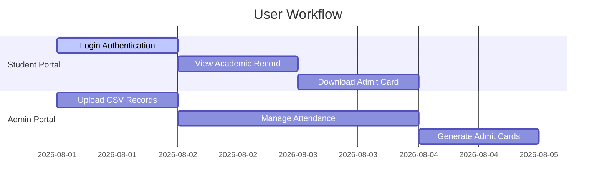

# 🎓 Admission & Academic Management Portal (admAll)

[](https://www.oracle.com/java/)
[](https://tomcat.apache.org/)
[](https://getbootstrap.com/)
[](LICENSE)

## ℹ️ About Project

The **Admission & Academic Management Portal (admAll)** is an integrated academic portal serving students and administrators. It provides end-to-end workflows for managing student admissions, course departments, attendance tracking, and dynamic digital admit card generation complete with photo and signature verification layouts.

---

## 🌟 Features

- 🔐 **Dual Portal Access**: Authenticated login interfaces for administrators and enrolled students.
- 🪪 **Admit Card Generator**: Automated admit card rendering with student photographs, digital signatures, examination schedule, and roll number details.
- 🏛️ **Department Directory**: Interactive department catalog, course list, faculty details, and academic session tracking.
- 📋 **Attendance Tracking**: Real-time attendance monitoring, student roll-call verification, and updates.
- 📊 **CSV Data Integration**: Automated CSV parsing and data update service (`CSVHelper.java`).
- 🔒 **Security & Cryptography**: Encrypted authentication pipelines and credential protection (`CryptoHelper.java`).

---

## 📐 Use Case Diagram



---

## 🛠️ Tech Stack & Components

| Layer | Component | Details |
| :--- | :--- | :--- |
| **Frontend** | HTML5, CSS3, JavaScript, Bootstrap 5 | Single-page UI components, responsive tables, admit card print layouts. |
| **Backend** | Java Servlets (`HttpServlet`) | Controllers for login, sessions, record updates, and department information. |
| **Utilities** | `CSVHelper`, `CryptoHelper`, `DBHelper` | Data parsing, SHA/AES encryption, database query builders. |
| **Database** | MySQL + HikariCP | Connection pooled database backend (`DbConnection.java`). |

---

## 📁 Repository Structure

```text
admall/
├── src/
│   └── main/
│       ├── java/
│       │   ├── apps/
│       │   │   └── admall/
│       │   │       ├── servlet/             # Servlets (Login, AdmitCard, Attendance, Department)
│       │   │       └── util/                # Utilities (CSV, Crypto, DB helpers)
│       │   └── apps/
│       │       └── dbservice/               # HikariCP connection pool
│       ├── resources/
│       │   └── db.properties                 # Database connection settings
│       └── webapp/
│           └── apps/
│               └── admall/                  # Web pages, styles, and scripts
└── README.md
```

---

## 🚀 Setup & Launch

1. Configure `src/main/resources/db.properties` with your MySQL credentials.
2. Deploy the application onto Apache Tomcat 9.0+.
3. Open in browser:
   ```text
   http://localhost:8080/apps/apps/admall/index.html
   ```

---

## 📄 License
Licensed under the **MIT License**.
